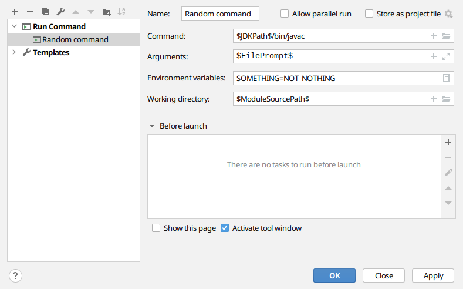
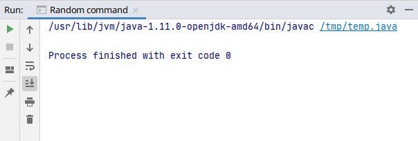

# RunAnything
This repository provides the source of an JetBrains IDE plugin.
It adds a Run Configuration that can run/execute any command/executable.
There is support for setting environment variables and the working directory.
All but the environment variables field has support for macros.

[This plugin on the marketplace](https://plugins.jetbrains.com/plugin/16128-runanything)

## Example

Example of the Run Configuration:



Running this configuration provides the following result:



## Compiling
Use gradle to build the plugin:

```
./gradlew assemble
```

The output should be in `build/distributions`.
