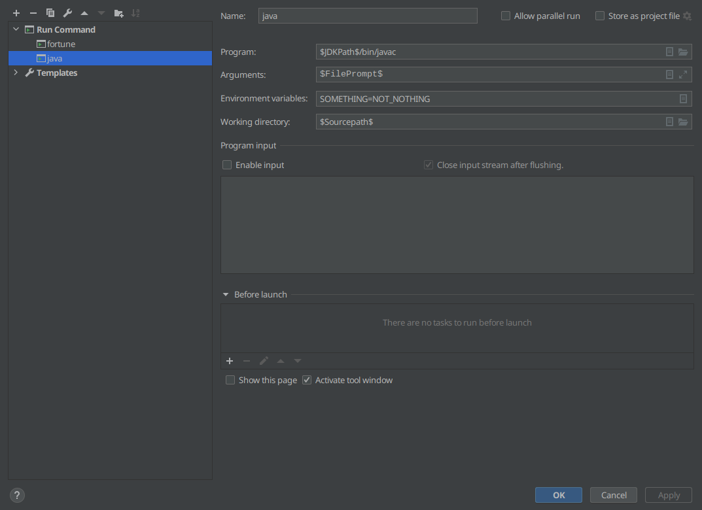
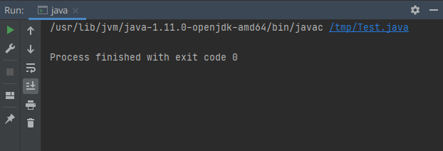
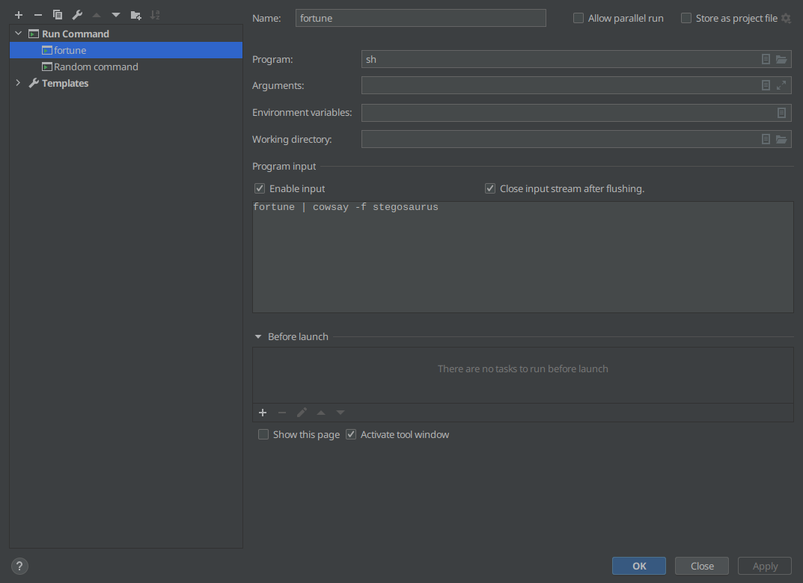
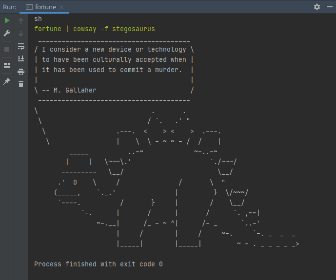

# RunAnything
This repository provides the source of an JetBrains IDE plugin.
It adds a Run Configuration that can run/execute any command/executable.
There is support for setting environment variables and the working directory.
You can also provide program input to save you the hassle of typing in the console.
All but the environment variables and the program input fields have support for macros.

[This plugin on the marketplace](https://plugins.jetbrains.com/plugin/16128-runanything)

## Example

Example of the Run Configuration:



Running this configuration provides the following result:



Run shell scripts without creating any extra files like so:



Which will result in the following run:



## Compiling
Use gradle to build the plugin:

```
./gradlew assemble
```

The output should be in `./build/distributions`.

[io.github.aveenstra.runAnything.RunAnythingConfigurationType](src/main/java/io/github/aveenstra/runAnything/RunAnythingConfigurationType.kt) provides the toplevel definition of the run configuration.

Options of the run configuration are represented by [io.github.aveenstra.runAnything.RunAnythingConfigurationOptions](src/main/java/io/github/aveenstra/runAnything/RunAnythingConfigurationOptions.kt).

The UI is provided by [io.github.aveenstra.runAnything.RunAnythingSettingsEditor](src/main/java/io/github/aveenstra/runAnything/RunAnythingSettingsEditor.kt) together with its [form](src/main/java/io/github/aveenstra/runAnything/RunAnythingSettingsEditor.form).
